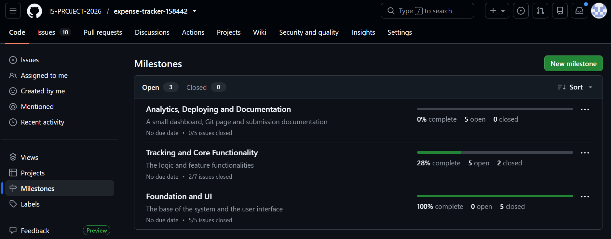
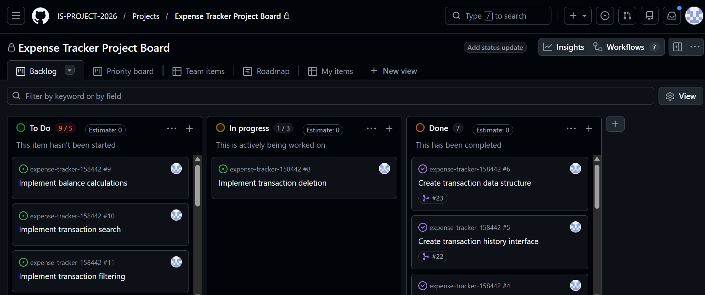
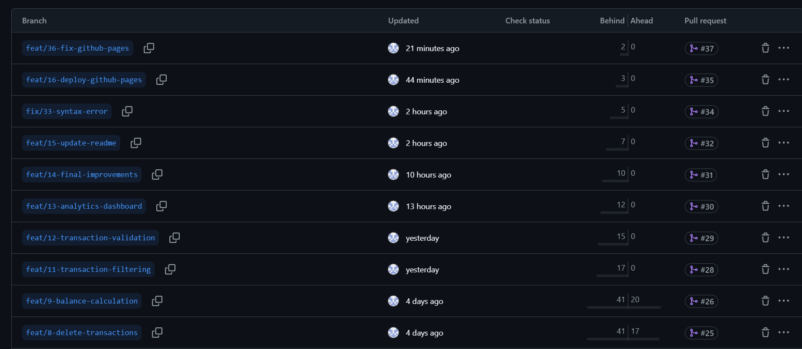
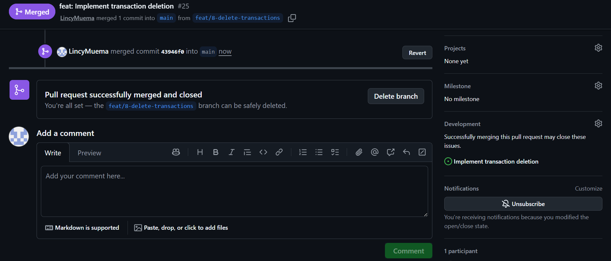
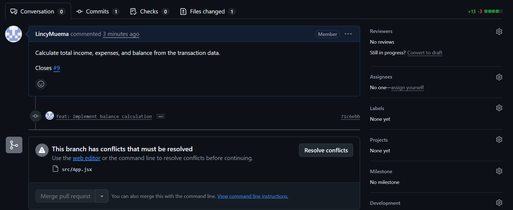
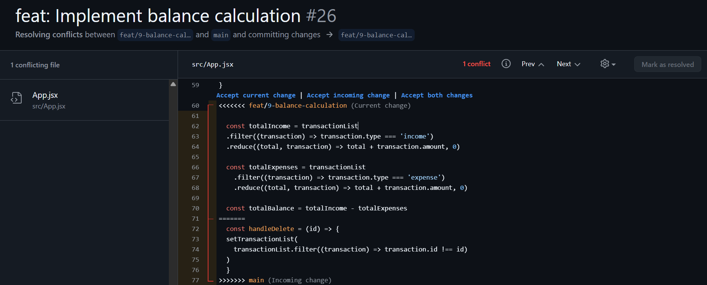
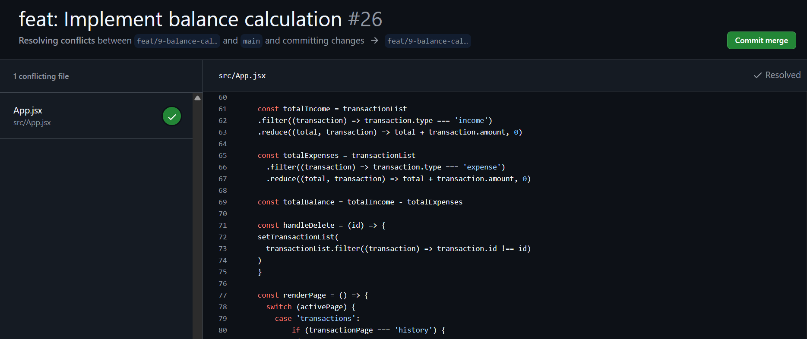
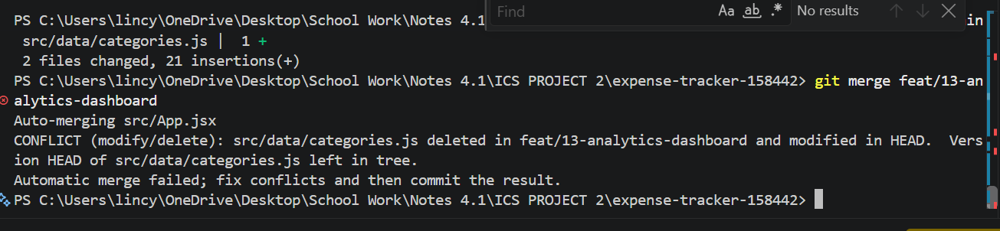
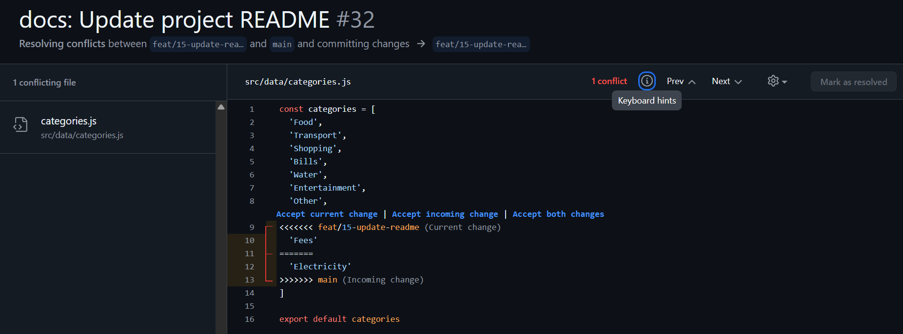

# Project Submission Report

## 1. Student Details

- **Full Name: Lincy Muema** 
- **GitHub Username: LincyMuema** 
- **Email: lincy.muema@strathmore.edu** 

---

## 2. Deployed Project Link

- **Live GitHub Pages URL:** https://is-project-2026.github.io/expense-tracker-158442/

---

## 3. Reflection — Grounded in Your Git History

### A. Your Best Commit

- **Commit URL:** https://github.com/IS-PROJECT-2026/expense-tracker-158442/commit/10615c2cceb6af76df012ab919fa1782e18fa9e9 
- **Why this one?** The commit follow the Convential Commit Order and is weel structured

### B. A Mistake or Struggle

- **Link to the evidence:** https://github.com/IS-PROJECT-2026/expense-tracker-158442/commit/3bfa17bff0419524d44fe00688a22fbdad2bfa9a 
- **What happened and how did you recover?** When solving the conflict, I forgot to add a missing comma. I solved it by creating a new issue and fixing the syntax error.

### C. A Pull Request You're Proud Of

- **PR URL:** https://github.com/IS-PROJECT-2026/expense-tracker-158442/commit/ef24f233dc30ce448932f35c98d59d11249e8d4e 
- **What did you check before merging?** I ensured everything was correct

### D. One Thing You Would Do Differently

- **What would you change?** I would chnage the arrangement of Issues
- **Link to the evidence of the original decision:** https://github.com/IS-PROJECT-2026/expense-tracker-158442/issues?q=is%3Aissue%20state%3Aclosed

---

## 4. Screenshots of Key GitHub Features

Demonstrate your workflow mechanics by embedding your screenshots below.

### A. Milestones and Issues

* **Caption:** Milestones for the project are Foundation and UI (building the foundation of the webpage and the User Interface), Tracking and Core Functionality (building the core functionalities of the system), and Analytics, Deploying and Documentation (the dashboard and documentation as well as deployment) showing progress tracking and associated issues.

### B. Project Board

* **Caption:** GitHub Project Board organizing issues across To Do, In progress, and Done workflows.

### C. Branching Architecture

* **Caption:** The image shows the branches I created maining containing feat

### D. Pull Requests & Traceability

* **Caption:** Merged Pull Request #25 - feat: Implement transaction deletion showing branch merge into main and direct linking to issue #8.

---

## 5. Merge Conflict Evidence

---

### Conflict 1 — Full Chronology

**What cause did you use?** Same Line Edits

#### Step 1: Generating the Clash

* **Caption:** Branches 9 and 8 had a conflict issue

#### Step 2: Inside the Code Editor (Conflict Markers)

* **Caption:** Branch #9 Modifies lines from what branch #8 had

#### Step 3: Resolution & Clean Merge

* **Caption:** Accepted branch 9 changes

---

### Conflict 2 — Different Cause

**What cause did you use?** Delete VS. Modify

**Why does this cause trigger a conflict?** One branch modifies a file while the other deletes the same file.

* **Caption:** Branch 12 modified the category file while 13 delete the same category file.

---

### Conflict 3 — Different Cause

**What cause did you use?** The Appended List

**Why does this cause trigger a conflict?** Two branches add text  to the bottom of the same list

* **Caption:** Branch #14 added Electricity while the branch #15 added fees

---

